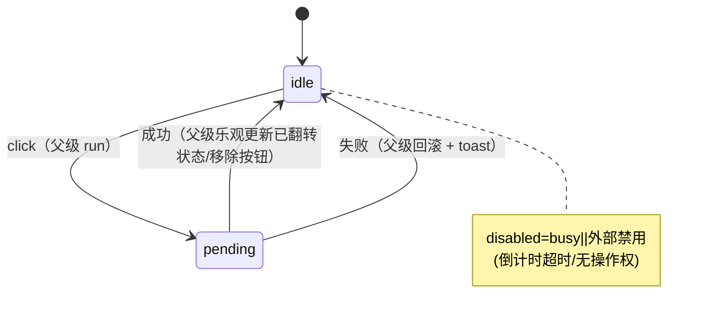
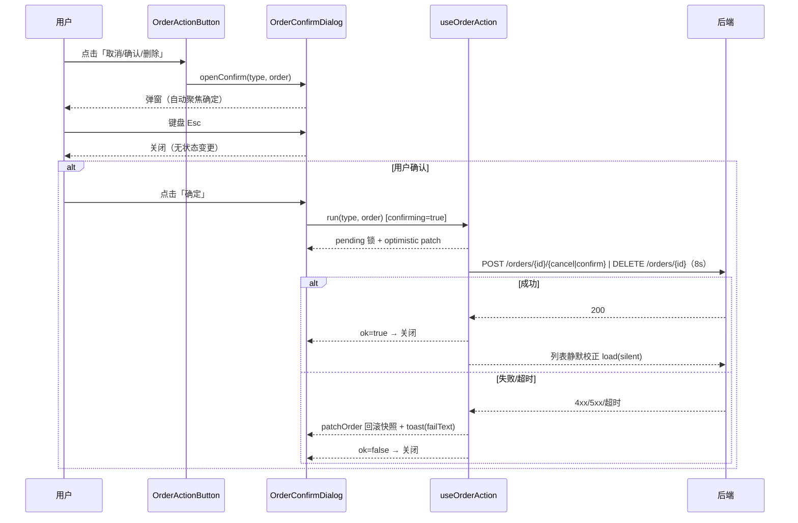
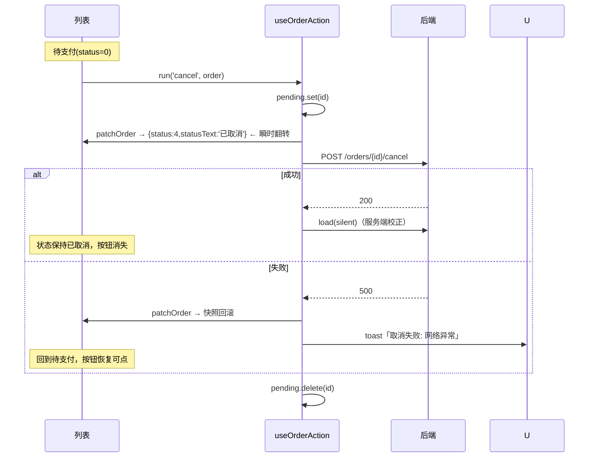
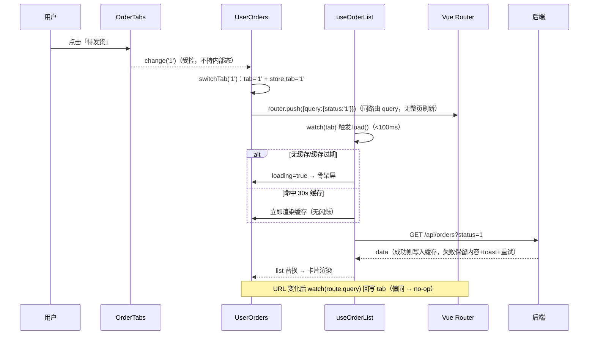

# 订单操作交互重构 — 规格说明（Spec）

> 项目：dyshop 购物程序 · 模块：订单操作交互（ch10）
> 状态：v1.0 定稿（前端 build 通过 + 后端 compile 通过 + Playwright 边界用例通过）
> 关联：`docs/ch07/spec.md`（订单结算与状态机）、`docs/ch08/`（后台管理）
> 背景：P0 体验缺陷 —— 订单列表「去支付 / 取消订单 / 确认收货 / 删除」点击后无即时反馈，
>   弱网下用户误判失败而重复点击，导致重复提交与状态错乱风险。
> 目标：**毫秒级视觉响应 + 可靠状态同步**：每次点击都有明确、即时、可回滚的反馈。

## 1. 目标

- 点击操作按钮 50ms 内出现 UI 反馈（loading / 禁用 / 文案切换），不等待接口返回。
- 接口完成前禁止二次点击（单订单状态锁 + 全局互斥）。
- 接口失败 / 超时（8s）自动回滚乐观状态 + toast 具体错误原因。
- 支持批量操作：所有选中订单按钮同步 loading。
- 高可用兜底：后端动作接口幂等（重复调用对已处于目标状态返回成功）。

## 2. 范围

### 2.1 本期（In Scope）

| 编号 | 内容 | 归属 |
|---|---|---|
| S1 | `useOrderAction` 命令模式组合函数：命令注册表 + pending 状态锁 + 乐观更新 + 失败回滚 + 批量 | 前端 |
| S2 | `OrderActionButton` 状态机按钮组件：idle → pending(loading+禁用) → idle（成功由父级翻转/移除） | 前端 |
| S3 | `OrderConfirmDialog` 二次确认弹窗：取消/确认/删除必经拦截，键盘可用（Tab/Enter/Space/Esc） | 前端 |
| S4 | 订单列表页（`UserOrders.vue`）集成：对齐 ops 操作区 + 确认弹窗 + loading/禁用 | 前端 |
| S5 | 后端幂等：cancel/pay/confirm/remove 对「已处于目标状态」幂等返回成功（no-op） | 后端 |
| S6 | 动作接口 8s 超时（axios config），超时 → 回滚 + 「网络较慢，请稍后重试」 | 前端 |
| S7 | 文档：本 spec + plan + tasks + 边界测试清单 | 文档 |

### 2.2 本期外（Out of Scope）

- 批量多选 UI（复选框 + 全选）——本期仅实现 `runBatch` 钩子能力，批次选择 UI 后续补齐。
- 「查看物流」面板：本项目无物流数据模型（Order 仅 shipTime 时间戳），面板交互留待接入物流服务后。
- 支付弹窗（`PayModal`）本身的重构：沿用其内部 paying 自锁，本期仅保证列表页按钮触发弹窗即时反馈。

## 3. 核心交互原则

### 3.1 点击即响应（50ms 内）

`useOrderAction.run()` 在首个 `await` 之前同步完成：
- `pending.set(order.id)` → 列表按钮 `:busy` 立即 true → spinner + loading 文案渲染。
- 非删除动作乐观更新：`patchOrder` 不可变替换 `status/statusText/payDeadline`，状态文本瞬时改变。

### 3.2 防重复提交

- **pending 锁**：`pending`（`reactive(Map)`）记录进行中订单，`run()` 开头 `if (pending.has(id)) return`，同类/异类操作均被忽略。
- **组件双保险**：`OrderActionButton` 的 `:busy || :disabled` 双禁用；确认弹窗 `busy` 期间 Esc/外部点击/二次确认全部无效。
- **全局互斥**：列表 `anyPending` 下其他订单操作按钮同步禁用（真实并发冲突面最小）。

### 3.3 失败回滚

- `run()` 前快照订单受乐观更新影响的字段（status/statusText/payDeadline）。
- catch：`patchOrder` 用快照重建对象 → 恢复按钮 → toast `{failText}: {错误}`。
- 超时（axios `ECONNABORTED`/`timeout`）→ 统一「网络较慢，请稍后重试」。

### 3.4 批量操作

`runBatch(actionName, orders)`：先 `Promise.all` 并发逐个执行 `run`，每个订单独立成功/失败与回滚，返回 `{succeeded, failed}` 汇总。

## 4. 状态机

### 4.1 按钮状态机（OrderActionButton）



- **idle**：label 默认文案；`:disabled` 受 `busy` 与外部 `disabled` 双重控制。
- **pending**：spinner + loadingText + `aria-busy`，原生 `<button>` 键盘可用（Tab/Enter/Space）。

### 4.2 二次确认状态机（取消/确认/删除）



### 4.3 乐观更新时序（取消订单示例）



## 5. 接口契约（后端幂等）

> 签名见 `docs/ch07/spec.md` §5；本规格补充幂等性要求（已在
> `OrderServiceImpl` 中实现并在 `docs/ch07/plan.md` 记录）。

| 方法 | 路径 | 非幂等语义 | 幂等补充（本期新增） | 幂等失败 |
|---|---|---|---|---|
| POST | `/orders/{id}/cancel` | status 0→4 + 回补库存 | 已是 status=4 → 直接返回成功（不回补，库存已回） | 其余状态 → 400 |
| POST | `/orders/{id}/pay` | status 0→1 + 插支付单 + 加销量 | 已是 status=1 → 直接返回成功（不重复付款/加销量） | 其余状态 → 400 |
| POST | `/orders/{id}/confirm` | status 2→3 + 发积分 | 已是 status=3 → 直接返回成功（不重复发积分） | 其余状态 → 400 |
| DELETE | `/orders/{id}` | 逻辑删除（仅 3/4） | order 不存在（已删除）→ 直接返回成功 | 非终态 → 400 |

> 幂等生效场景：弱网超时→前端回滚→用户重试「取消/确认」，服务端已处理时将得到 200 而非 400，
> 前端不再出现「状态不允许…」的误导错误；积分/销量/支付单不会二次累加。

### JSON 格式

- 请求头沿用统一 `Authorization: Bearer <token>`；动作请求额外声明 `Cache-Control: no-store`。
- 成功：`{code:0, message:"成功", data:null}`；失败：`{code:400, message:"订单状态不允许…"}`。
- 超时约定（前端仅提示，不回滚）：8s 内无响应 → 前端统一错误提示并**不重发**（幂等兜底让重试安全）。

## 6. 前端技术要点

### 6.1 `useOrderAction` 命令注册表

```text
ORDER_ACTIONS = {
  pay:    { run: payOrder,   targetStatus: 1, needsConfirm: false, loadingText:'支付中…', successText:'支付成功',  failText:'支付发起失败' },
  cancel: { run: cancelOrder, targetStatus: 4, needsConfirm: true,  loadingText:'取消中…', successText:'订单已取消', failText:'取消失败' },
  confirm:{ run: confirmOrder,targetStatus: 3, needsConfirm: true,  loadingText:'确认中…', successText:'已确认收货', failText:'确认失败' },
  delete: { run: deleteOrder, targetStatus:null,needsConfirm: true, loadingText:'删除中…', successText:'订单已删除', failText:'删除失败' },
}
```

- 命令模式：新增动作 = 注册一条命令 + `api/order.js` 封一个函数，无需改动钩子。
- `targetStatus=null`（delete）不做乐观状态翻转，成功后再 `removeOrder` 移除行。
- 批量：`runBatch` 并发 `Promise.all`，最终汇总 `{succeeded, failed}` 供全选 toast。

### 6.2 不可变更新（防渲染异常）

- 列表 `orders` 为 `ref([])`；`patchOrder` 用 `orders.map(o => o.id===id ? {...o, ...patch} : o)` 重建数组，
  **绝不直接 mutate 订单对象**，避免 v-for `:key` 与 `computed` 依赖旧引用导致渲染闪断/不更新。

### 6.3 键盘可达

- `OrderActionButton` 用原生 `<button>`：Tab 聚焦、Enter/Space 触发，浏览器默认行为即满足。
- `OrderConfirmDialog`：打开即聚焦「确定」；`Esc` 关闭；`Tab` 焦点圈定（首尾循环），
  关闭后焦点归还触发元素。

## 7. 验收标准

- 点击任一动作按钮 50ms 内可见 loading/禁用/文案变化；连点/双 tab 同时点击仅执行一次。
- 取消/确认/删除必须先过确认框；确认后按钮 loading 锁定，Esc 不可中途退出。
- 模拟 500：操作回滚 + toast 失败原因，按钮恢复可点。
- 模拟响应延迟 12s（>8s）：8s 触发超时回滚 + 「网络较慢，请稍后重试」。
- 后端幂等：重复 cancel/pay/confirm/delete 返回 200 且不产生副作用（库存/销量/积分唯一）。
- 未登录访问 → 401；普通用户访问后台 /admin/** → 403（沿用 ch08 规则）。

## 8. 个人中心侧栏精简（菜单配置化）

> 补齐项：右侧操作按钮「点击无响应」修复后，侧栏「订单状态分类」与列表页 Tab 双份入口
> 造成路径重复（用户处于订单页仍能点击 待支付/待发货… 重新导航，认知负担高）。
> 本期将订单状态分类全部收敛到列表页 Tab 与 URL query，侧栏仅保留模块单入口 + 非订单导航。

### 8.1 决策：删除侧栏六个状态分类入口

| 删除项 | 替代路径 |
|---|---|
| 全部订单 | 「我的订单」模块单入口（进入后默认全量 Tab） |
| 待付款 / 待支付 | 列表页 Tab + URL `?status=0` |
| 待发货 | 列表页 Tab + URL `?status=1` |
| 待收货 | 列表页 Tab + URL `?status=2` |
| 已完成 | 列表页 Tab + URL `?status=3` |
| 已取消 | 列表页 Tab + URL `?status=4` |

保留项：账户管理（个人资料/安全设置/收货地址）、交易记录（我的订单/我的优惠券）、
偏好设置（我的收藏/浏览历史）、管理员后台组。

### 8.2 布局对比（文字描述版）

```text
┌───────────────────────────────────────────────────────────┐
│                        删除前                              │
├──────────────┬────────────────────────────────────────────┤
│ ⚫ 用户卡片   │                                            │
│ 账户管理     │   [全部订单] [待支付] [待发货]              │
│  · 个人资料  │   [待收货] [已完成] [已取消]  ↑ 6 个冗余入口 │
│  · 安全设置  │   与列表页 Tab 双份重复 → 认知负担           │
│  · 收货地址  │                                            │
│ 交易记录     │   [Tab: 全部/待支付/待发货/待收货/已完成]    │
│  · 我的订单  │   [×] [订单卡] [去支付]                     │
│  · 待支付    │   [×] [订单卡] [取消/确认/删除]             │
│  · 待发货    │                                            │
│  · 待收货    │                                            │
│  · 已完成    │                                            │
│  · 优惠券    │                                            │
│ 偏好设置     │                                            │
│  · 收藏/浏览  │                                            │
└──────────────┴────────────────────────────────────────────┘

┌───────────────────────────────────────────────────────────┐
│                        删除后（grid 240px 1fr）            │
├───────────────┬───────────────────────────────────────────┤
│ ⚫ 用户卡片    │  [Tab: 全部/待支付/待发货/待收货/已完成]     │
│ 账户管理      │   ↑ 唯一的订单状态筛选入口（含 ?status= 直达）│
│  · 个人资料   │   [×] [订单卡] [去支付]                     │
│  · 安全设置   │   [×] [订单卡] [取消/确认/删除]             │
│  · 收货地址   │                                            │
│ 交易记录      │   → 内容区 1fr 自动扩展填满剩余轨道          │
│  · 我的订单   │   无空白列；删除项不留占位                  │
│  · 优惠券     │                                            │
│ 偏好设置      │                                            │
│  · 收藏/浏览  │                                            │
└───────────────┴───────────────────────────────────────────┘
```

- 布局容器：CSS Grid `grid-template-columns: 240px 1fr`；内容区为 `1fr` 自适应轨道，
  无论菜单删减都自动填满剩余宽度（无固定像素/空白列）。
- 移动端（≤720px）：`grid-template-columns: 1fr` 单列堆叠，侧栏转静态块，无底部 Tab 形式，无需额外移除。

### 8.3 菜单配置化

- `src/config/userMenu.js`：`USER_MENU` / `ADMIN_MENU` 数组驱动渲染（`type: link | orders | todo`）。
- `src/components/user/SidebarMenu.vue`：纯展示组件，无业务逻辑；按钮型入口（orders/todo）上抛事件。
- 增删菜单 = 增删配置项，不改组件逻辑；已删除六项以注释留存供回溯。

### 8.4 URL query 保留能力

- `?status=0..4` 外部链接/书签直达依然有效：`UserOrders.vue` 的
  `watch(route.query.status)` → `STATUS_KEY` 映射 Tab（`'0'..'4'` → 对应 Tab）。
- 侧栏「我的订单」`goOrders`：已处于订单模块时点击不重置筛选（URL 不变）。

### 8.5 验收

- 侧栏不再渲染 待支付/待发货/待收货/已完成/已取消（全部订单亦无）✅ Playwright
- 非订单入口（资料/安全/地址/收藏/优惠券/浏览历史）保留 ✅
- 内容区宽度 = 1fr 轨道（总宽 − 内边距 − 侧栏 − 间距），无空白列 ✅（cw=792px@1100 容器）
- `?status=1` 直达激活「待发货」Tab ✅
- 侧栏菜单项 7 ≤ 历史 12，信息密度下降 ✅

## 9. 新旧交互对比

| 维度 | 原交互 | 新交互 | 改进 |
|---|---|---|---|
| 操作反馈 | 点击后无响应（等接口返回；弱网下看似「死按钮」） | <50ms spinner/loading/禁用（乐观状态瞬时翻转） | 操作效率：感知延迟降为 0 |
| 重复提交 | 连点可触发多次，弱网下重复扣款/状态错乱 | pending 锁 + 组件双禁用 + 后端幂等 no-op | 消除重复副作用 |
| 失败处理 | 报错突兀、状态已错乱无恢复 | 快照回滚 + toast 具体原因；8s 超时明确提示 | 可恢复性 |
| 高危操作 | 直接执行（取消/删除无确认） | OrderConfirmDialog 二次确认 + 键盘可达 | 认知负荷：决策前置 |
| 路由路径 | 侧栏 6 个状态入口 + 页内 Tab 双份 | 单入口 + Tab 单份，`?status=` 直达保持 | 少一条路径，认知负荷 ↓ |
| 信息密度 | 侧栏 11 项滚动才能看完 | 7 项一屏即览 | 密度适中，无干扰项 |

## 9.1 按钮状态流转时序图（摘录）

参见 §4.1/§4.2 状态机与 §4.3 乐观更新时序（cancel 示例）；
订单列表 ops 按钮已由原生 `<button>` 全部替换为 `OrderActionButton`（S2/T4）。

> 变更文件：`frontend/src/config/userMenu.js`（新增）、`frontend/src/components/user/SidebarMenu.vue`（新增）、
> `frontend/src/views/user/UserCenter.vue`（菜单渲染收敛到组件）。
> 验证：`npm run build` ✅ + 侧栏/布局/query 直达 Playwright 17/17 ✅ + 订单动作回归 4/4 ✅。

## 10. Tab 筛选联动修复（受控组件 + 请求 Hook + URL 同步）

> P0 缺陷：顶部筛选按钮点击后高亮变化但列表不刷新。
> 根因：旧 `switchTab` 先置 `tab.value` 再 `router.replace`，随后
> `watch(route.query.status)` 比对 `target === tab.value` 恒等短路，`load()` 永不执行；
> 且 watch 内 `ordersStore.tab` 兜底会覆盖浏览器后退到「全部」的状态。
> 修复原则：**列表拉取只由 `useOrderList(tab)` 对 tab 值的 watch 触发**，URL 与 Tab 均为
> 同一状态源的镜像，任何入口（点击/手势/后退/直达链接）都唯一收敛到一次 refetch。

### 10.1 组件与职责

| 件 | 职责 | 受控约束 |
|---|---|---|
| `OrderTabs.vue` | 分段控件：`modelValue` 驱动高亮，仅 emit `update:modelValue/change` | 内部零选中态 |
| `useOrderList(statusKey)` | 列表请求：watch(tab)→refetch；30s Tab 缓存；骨架/错误语义；竞态 seq 丢弃 | 状态值由父级注入 |
| `UserOrders.vue` | 真源 `tab = ref(tabFromQuery())`；URL watch 回写 tab；switchTab 更新 tab + `router.push` | 单一数据源 |

### 10.2 Tab 状态 ↔ 接口参数映射（前端枚举 ↔ 后端枚举）

| Tab 文案 | 前端 key（URL query 值） | 接口 status 参数 | 后端枚举 | 说明 |
|---|---|---|---|---|
| 全部 | `all`（无 query） | 不传 `status` | — | `fetchOrders(undefined)` → params `{}` |
| 待支付 | `0` | `0` | status=0 | 含倒计时支付 |
| 待发货 | `1` | `1` | status=1 | — |
| 待收货 | `2` | `2` | status=2 | 确认收货按钮 |
| 已完成 | `3` | `3` | status=3 | 删除入口 |
| 已取消 | `4` | `4` | status=4 | 删除入口 |

- 非法值（如 `?status=9`）→ `tabFromQuery()` 回退 `all`（`STATUS_KEY` 白名单）。

### 10.3 数据流时序图（点击 Tab）



### 10.4 URL 双向闭环

- **写入**：`switchTab` → `router.push({ query })`（push 支持前进/后退遍历 Tab；同路由 query 变更不重挂组件）。
- **读取（外部驱动）**：`watch(() => route.query.status)` 仅「回写 tab（值不同才写）」+ 记录 store；
  拉取由 hook watch 完成，避免双入口重复请求。
- **可分享/书签/直达**：`/user/orders?status=2` 挂载时以 URL 为初始种子（`ref(tabFromQuery())`），
  跳过「先拉全部再跳目标态」的双请求。
- **后退**：`?status=1 → 无 query` 时 URL 解析为 `all` 并刷新（此前被 store 兜底覆盖为错 Tab）。

### 10.5 缓存与错误语义

- 30s Tab 级缓存（会话 Map，key=tabKey）：命中 → 直接渲染 + 后台静默刷新；过期 → 骨架屏。
- 手动刷新/失败重试：`refresh()` 清当前 Tab 缓存强制拉取。
- 失败：**不**清空列表；有内容 → 顶部细 banner + 重试；无内容 → 整区错误态 + 重试按钮；统一 toast「加载失败，点击重试」。
- 列表容器 `:key="tab"`：切 Tab 强制重建 DOM，杜绝跨 Tab 复用残留（倒计时/滚动位置）。
- 竞态：`requestSeq` 自增比对，快速连续切换只采纳最后一次响应。

### 10.6 验收

- 点击 Tab：100ms 内骨架/缓存可见 + `?status=X` 同步 + 列表刷新（新请求断言）✅
- 前进/后退：URL 变化 → Tab 与列表自动同步（goBack 断言）✅
- 快速连续 3 切：终态决定列表，无旧数据残留 ✅
- 直达链接 `?status=2`：激活对应 Tab 并加载 ✅
- 骨架屏：无缓存 Tab 先 loading（600ms 延迟注入断言）✅；缓存命中不闪骨架 ✅
- 失败 500：保留内容 + toast + 重试恢复 ✅；空态含插画文案 ✅
- 回归：订单动作边界 4/4、侧栏精简 17/17 ✅

> 变更文件：`composables/useOrderList.js`（新增）、`components/shop/OrderTabs.vue`（新增）、
> `views/user/UserOrders.vue`（tab/watch/switchTab 重构、模板接入受控 Tab、错误 banner、空态插画）。
> 验证：`npm run build` ✅ + Tab 联动 Playwright 9/9 ✅。