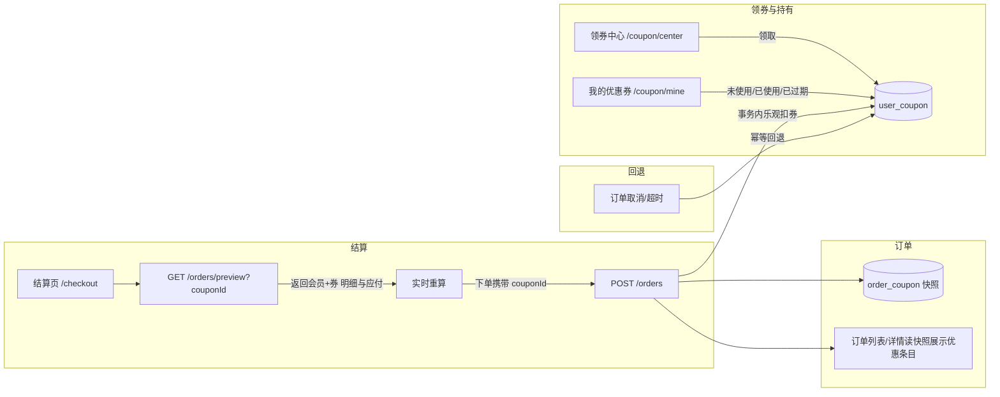

# 优惠券模块 — 规格说明（Spec）

> 项目：dyshop 购物程序 · 模块：优惠券（ch11）
> 状态：v1.0 设计稿（待评审，未开发）
> 关联：`docs/ch07/`（订单结算与状态机）、`docs/ch09/`（会员等级折扣）、`docs/ch10/`（订单交互重构）
> 前置：C 端登录（ch01）、订单结算（ch07）、会员价格体系（ch09）

## 1. 目标

为 C 端用户提供完整的优惠券闭环：**后台创建配置券模板 → C 端领券中心自助领取 → 结算页选择券并实时算价 → 下单事务内扣券 → 订单券快照留痕 → 取消/超时自动回退**；后台提供模板管理、定向发放与用户持券管理。与会员等级折扣（ch09）可配置叠加。

## 2. 范围

### 2.1 本期（In Scope）

| 编号 | 内容 | 归属 |
|---|---|---|
| S1 | 券形态：满减券（满 X 减 Y）与无门槛立减券（门槛 0），统一为「减额型」模板 | 后端 |
| S2 | 后台券模板管理：新建/编辑/启用禁用/停发；字段除基础外含范围、叠加、有效期、限量、限领 | 前后端 |
| S3 | 后台发放：指定用户 / 全员发放（按模板实例化 user_coupon） | 后端 |
| S4 | 后台用户券管理：分页与搜索、用户券作废、发放统计 | 前后端 |
| S5 | C 端领券中心：模板列表 + 领取（每人限领 1 张、总量限量防超发） | 前后端 |
| S6 | C 端我的优惠券：未使用/已使用/已过期三种状态分列表 + 失效自动标记 | 前后端 |
| S7 | 结算页选券：可用券列表、门槛提示（还差 ¥X）、实时算¥、下单携带 couponId | 前后端 |
| S8 | 下单事务内扣券（乐观锁防双被扣）→ orders.discount_amount + order_coupon 快照 | 后端 |
| S9 | 取消/超时自动回退券（保留原有限期，复用 ch07 超时任务） | 后端 |
| S10 | 文档：spec / plan / tasks / manual-test | 文档 |

### 2.2 本期外（Out of Scope）

- 打折券（8.8 折）、随机红包券、兑换码/卡密券
- 多券同时叠加、优惠分摊到 order_item
- 券转赠、退款比例退券（本项目无部分退款）
- 会员等级 / 新用户等身份条件券（模板无身份门槛字段，留作后续）
- 前台运营活动页、券过期微信/短信提醒

## 3. 数据模型（新增）

### 3.1 `coupon_template` 券模板（后台配置，1 对 N 实例）

| 字段 | 类型 | 说明 |
|---|---|---|
| id | bigint PK | |
| name | varchar(64) | 模板名（展示） |
| type | varchar(16) | `REDUCE`（立减型：满减或无门槛），预留 `DISCOUNT` |
| min_amount | decimal(10,2) | 满减门槛，`0` = 无门槛立减 |
| discount_amount | decimal(10,2) | 立减金额（>0 校验；允许大于门槛的特殊券，不做上限限制） |
| scope | varchar(16) | `ALL` 全场（无限制） / `LIMITED` 有限定（下方分类/商品列表至少一项非空） |
| category_ids | json(NULL) | 指定分类 id 数组（可空；LIMITED 时与 product_ids 并集生效） |
| product_ids | json(NULL) | 指定商品 id 数组（可空；LIMITED 时与 category_ids 并集生效） |
| allow_stack | tinyint(1) | `1` 可与会员等级折扣（ch09）叠加；`0` 订单含会员折扣/专享价商品时禁装（详见 §6.4） |
| issue_type | varchar(16) | `CENTER` 可领券中心领取；`MANUAL_ONLY` 仅后台发放 |
| valid_type | varchar(16) | `FIXED` 固定起止 / `AFTER_DAYS` 领取后 N 天 |
| start_at / end_at | datetime | FIXED 生效区间（可为空表示长期） |
| valid_days | int | AFTER_DAYS 领取后有效天数（0=长期） |
| total_quantity | int | 可发放/可领取总数量，`-1` 不限 |
| per_user | int | 每人限领张数（领券与发放统一，本期通常 1） |
| issued_count | int | 当前已发放（领取+发放）量，做乐观限制 |
| status | tinyint | `1` 启用 / `0` 停用 |
| create_at / update_at | datetime，预计 | 审计 |

### 3.2 `user_coupon` 用户持有券

| 字段 | 类型 | 说明 |
|---|---|---|
| id | bigint PK | |
| user_id | bigint | 持券人 |
| template_id | bigint | 来源模板 |
| status | tinyint | `0` 未使用 / `1` 已使用 / `2` 已过期 |
| source | varchar(16) | `CENTER` 领取 / `MANUAL` 发放 |
| used_order_id | bigint NULL | 当前占用订单（下单写入；回退置空） |
| received_at | datetime | 领取/发放时刻 |
| expire_at | datetime | 有效期到期（AFTER_DAYS 计算、FIXED 复制 end_date） |
| UNIQUE(user_id, template_id, source) | | 领取/发放同款同人对同一 source 最多 1 张，防重复领取 |

### 3.3 `order_coupon` 订单券快照（防后改与串号）

| 字段 | 类型 | 说明 |
|---|---|---|
| id | bigint PK | |
| order_id | bigint | UNIQUE 一单一张券（强制本期「一单一券」） |
| user_coupon_id | bigint | 消费的持有券实例 |
| template_id | bigint | 模板冗余 |
| template_name | varchar(64) | 名称快照（模板后改不影响历史） |
| scope | varchar(16) | 范围快照（ALL / LIMITED 可含分类与商品两个列表） |
| discount_amount | decimal(10,2) | 实际抵扣额（≤ 使用小计与券额） |
| used_at | datetime | 下单扣券时刻 |

### 3.4 订单表增量

- `orders` 新增 `discount_amount` DECIMAL(10,2) NOT NULL DEFAULT 0 —— 券优惠总额。
- 语义：`total_amount` = Σ item.subtotal（会员价已含，ch07/ch09 引入）；`pay_amount = total_amount − discount_amount`（≥ 0 校验）。
- **不**在 `order_item` 分摊折扣（一期订单级扣；对账分析以 order_coupon + orders.discount_amount 为准）。

> 唯一索引 `order_coupon.order_id` + `user_coupon.status/used_order_id` 承担幂等与并发防重。

## 4. 接口设计

> 沿用权限体系：后台 `/api/admin/coupon/**`（ROLE_ADMIN，ch08）、C 端 `/api/user/coupon/**` 与结算相关 `/api/orders/**`（需登录）。

### 4.1 后台

| 方法 | 路径 | 说明 |
|---|---|---|
| GET | `/api/admin/coupon/templates` | 模板分页/搜索 |
| POST | `/api/admin/coupon/templates` | 新建模板 |
| PUT | `/api/admin/coupon/templates/{id}` | 编辑（不允许改已领取模板的 amount/scope/category_ids/product_ids/valid，只许改说明与状态） |
| PATCH | `/api/admin/coupon/templates/{id}/status` | 启用/停用 |
| DELETE | `/api/admin/coupon/templates/{id}` | 逻辑删除（仅停用状态的模板） |
| POST | `/api/admin/coupon/grants` | 按用户/全员发放（body: templateId, target: all 或 userId[]) |
| GET | `/api/admin/coupon/user-coupons` | 用户券分页/搜索（用户/手机号、模板、状态、领取时间） |
| PATCH | `/api/admin/coupon/user-coupons/{id}/void` | 手动作废（仅未使用状态的） |

### 4.2 C 端

| 方法 | 路径 | 说明 |
|---|---|---|
| GET | `/api/user/coupon/center` | 领券中心模板列表（含每人领取情况与剩余量） |
| POST | `/api/user/coupon/center/claim?templateId=` | 领取（幂等：重复领取返回 409 + 「已领取」） |
| GET | `/api/user/coupon/mine?status=0/1/2&page` | 我的优惠券（三种状态） |
| GET | `/api/orders/preview` | 结算价预览（扩：可选 couponId，返回明细+券抵扣+应付），供结算页实时重算 |
| POST | `/api/orders` | 下单扩展：body 增 `couponId`（可选） |

### 4.3 下单选券请求/响应示例（重点）

```jsonc
// POST /api/orders
{ "source": "cart", "addressId": 90, "couponId": 1001 }
// 响应
{
  "code": 0,
  "data": {
    "id": 47,
    "totalAmount": "337.00",
    "discountAmount": "30.00",
    "payAmount": "307.00",
    "coupon": { "templateName": "满 300 减 30", "discountAmount": "30.00" }
  }
}
```

## 5. 核心算法

### 5.1 适用商品小计（门槛口径）

给定订单商品集合 `items`（已含会员价），券 `c`：

```
适用集合 = scope==='ALL' ? items
          : items ∩ ( category_id ∈ c.category_ids ∪ product_id ∈ c.product_ids )
适用小计 S = Σ item.subtotal（适用集合内）
```

- 门槛判定：`S >= c.min_amount` 才可用；`min_amount=0` 无要求。
- 计算优惠：`discount = min(c.discount_amount, S)`（防超扣：优惠不超过适用小计）。
- 前提校验：`pay_amount = total_amount − discount ≥ 0`。

### 5.2 可用券筛选（结算页 preview / 渲染券列表）

对每张券按序判定，任一不满足即不可用（前端展示原因）：

1. `user_coupon.status = 0`（未使用）
2. 未过期：`expire_at > now`
3. `S ≥ min_amount`（满减门槛）
4. 适用小计内**至少一件**适用商品（S > 0）
5. 叠加规则（allow_stack，见 §6.4）

### 5.3 扣券（下单事务、原子防并发）

```
事务 BEGIN
  1. 预校验（只读）：user_coupon 属主、status=0、未过期
  2. 计算适用小计/折扣（校验通过）
  3. 乐观扣券： UPDATE user_coupon
        SET status=1, used_order_id=?, used_at=now
        WHERE id=? AND status=0 AND (expire_at IS NULL OR expire_at>=now)
      影响行数≠1 → 抛「优惠券已被使用」（并发保护）
  4. INSERT orders（discount_amount=discount）
  5. INSERT order_coupon(..., discount) 【order_id 唯一约束二次防重】
COMMIT；失败 → 整体回滚（券状态回滚为 0）
```

### 5.4 回退券（取消 / 超时）——幂等

订单进入终态 4（手动取消）或超时任务判定取消时，同事务执行：

```
UPDATE user_coupon
  SET status = IF(expire_at < now, 2, 0),
      used_order_id = NULL, used_at = NULL
  WHERE used_order_id = ?orderId AND status = 1 AND source IN ('CENTER','MANUAL')
```
- 保留原 `expire_at`（不重新计时）；若已过期则置 `status=2` 作废。
- 幂等：重复调用因 `WHERE` 条件已不命中 → 0 行，无副作用。
- 与「取消订单」原有逻辑（库存回补、积分回补）同事务，同一把锁。

### 5.5 领取（并发防超领）

```
事务：
  SELECT tpl FOR UPDATE（或乐观 UPDATE 变量）
    校验 status=1、issue_type='CENTER'、FIXED 区间内
  1) 每人限领：per_user=1 → 存在同 user + template 的未使用券 → 409「已领取」
  2) 总量：total_quantity>=0 时 issued_count<total，否则「已抢光」；
     采用原子 UPDATE coupon_template
       SET issued_count = issued_count + 1
       WHERE id=? AND (total_quantity=-1 OR issued_count+1 <= total_quantity)
     影响行数≠1 → 「已抢光」
  3) INSERT user_coupon(status=0, source='CENTER', expire_at 按模板计算)
COMMIT
```

### 5.6 有效期计算

- `valid_type=FIXED`：`expire_at = end_date`（end_date 可空=长期）。
- `valid_type=AFTER_DAYS`：`expire_at = 领取时刻 + valid_days 天`；`valid_days=0` 长期。
- 后端统一计算（领券处）；前端不用自行推算。

## 6. 业务规则与边界

### 6.1 一单一券

`order_coupon.order_id` 唯一约束强制；本期无多券叠加。结算页选券为单选，换券重算。

### 6.2 门槛只认适用商品

不适用商品照常下单，但**不**计入门槛、**不**可被券抵扣。半相关示例：

> 券「满 200 减 20（分类 A ∪ 商品 P）」；订单含分类 A 小计 150 + 商品 P 小计 60 + 分类 B 小计 100 → 适用小计 = 150 + 60 = 210 ≥ 200，可用，优惠 20，实付 = 310 − 20 = 290。

### 6.3 优惠上限

- `discount_amount ≤ 适用商品小计`（`min` 截断）。
- 整单 `pay_amount ≥ 0`；若券额 ≥ 应付（极端）→ 优惠截断为 `total_amount`，实付 0，不返现。

### 6.4 与会员折扣的关系（v1.1 修订：二选一自动取优）

> v1.0 原设计为 `allow_stack` 模板级互斥（命中会员折扣即整券禁用），评审后改为
> **二选一自动取优**：优惠券永不被会员身份禁用，系统自动比较两种支付方式并采用更省的一种。

- **方式 A（会员方案）**：实付 = 会员价合计（享受 vip_price / 等级折扣）。
- **方式 B（券方案）**：实付 = 原价合计 − 券抵扣（用券时放弃会员价，门槛/抵扣按原价小计判定）。
- 结算页选券后系统计算两种方案并取 `min(实付A, 实付B)`：
  - 券方案更省 → 券生效（扣券 + order_coupon 快照 + orders 记券优惠）；
  - 会员方案更省 → 券不生效（保持未使用，preview 返回 `couponApplied=false`，前端提示「会员价更优惠，券未生效」）。
- 口径：`orders.total_amount` = 原价合计；`orders.discount_amount` = 自动取优后的总优惠
  （会员方案=会员优惠额，券方案=券抵扣额）；`pay_amount = total_amount − discount_amount` 恒成立。
- 兼容：`allow_stack` 字段保留（数据兼容），但不再参与互斥判定。

### 6.5 取消与超时

- 用户手动取消（终态 4）→ 退券；已支付后无取消（ch07 状态机）。
- 未支付超时 → 复用 ch07 定时任务，追加退券动作（同事务）。
- 支付成功后券终态为「已使用」，无其他回退路径。

### 6.6 领取/发放约束

- 领取中心每人同「模板 + CENTER」限 1 张（unique 索引兜底）；发放（MANUAL）可另计每人限领。
- 模板「停用」不影响已发放未使用券（仍在有限期内可用），仅停新领取。
- 模板「逻辑删除」前必须停用且无未使用的已发券或由运维清理。

## 7. 前端交互流程

### 7.1 C 端



### 7.2 结算页 UI 约束

- 选券入口：实付金额行附「优惠券」入口（或直排可选清单）。
- 不可用券渲染 `disabled` + 原因（未满门槛「还差 ¥X 可用」/ 已过期 / 与会员折扣冲突）。
- 选中后调用节流 → `GET /api/orders/preview?couponId=` 重算应付并展示「-¥Y」。
- 一单 1 张：勾选一张自动取消先选；再次点击取消选择→恢复无券预览。
- 下单成功后清空结算状态中的选券缓存（防止重复下单再带券）。

### 7.3 后台页面

- 模板列表：表格 + 搜索 + 状态筛选；行内「发放」「停用」「编辑」。
- 新建/编辑：表单含全部字段；范围支持「指定分类」「指定商品」**并行多选**（并集生效，至少填一项）；改 amount/scope/category_ids/product_ids/valid_type 仅对新领取生效（前端提示）。
- 发放弹窗：选模板、选范围（全部 / 指定用户勾选）、执行（幂等：发放指定用户同源存在时 409 提示）。
- 用户券管理：分页列表、按用户/状态过滤；未使用券可「作废」操作带确认。

## 8. 并发与幂等要点

| 场景 | 机制 |
|---|---|
| 领取超发 | 模板乐观 UPDATE（issued_count < total）+ 唯一索引兜底 |
| 同一券双扣 | user_coupon 乐观 `UPDATE ... WHERE status=0`（rows=1）+ order_coupon.order_id 唯一索引兜底 |
| 重复下单用券 | 前端禁用 + 后端幂等（同订单再提交覆盖/拒绝） |
| 重复退券 | 回退 WHERE used_order_id=.. AND status=1 → 重复执行 0 行 |
| 多 tab 支付（ch10 已有） | 下单即扣，无支付时二次扣；支付幂等沿用 |

## 8.5 定时任务（复用 ch07）

- 扫描 `status=0 AND created_at < now-超时` 的超时订单 → 取消 + 回补库存 + 回退券。
- 顺带对 `user_coupon.status=0 AND expire_at<now` 批置 status=2（可选，展示已惰性判定）。

## 9. 验收标准

- 后台可建模板（满减/无门槛）、停用、启用；发放指定用户可见。
- C 端领券中心领取 1 次成功、重复领取 409；总量饱和后提示「抢光」。
- 结算页可见可用券、门槛未满 disabled 文案正确；选券实时算¥并同步应付。
- 下单成功扣券：orders.discount_amount = 券额度；order_coupon 快照正确；券状态→已使用。
- 并发双下单抢一张券：仅一单成功，另一单「优惠券已使用」。
- 取消/超时订单：券回退未使用（保留有效期）；退款与库存幂等不重复。
- 过期券：不可用、状态展示已过期。
- 后台用户券管理：分页/搜索/作废生效。

## 10. 风险与对策

| 风险 | 对策 |
|---|---|
| 并发抢最后一券 | 乐观锁 issued_count、unique 索引、SQL 原子扣券 |
| 券与会员叠加超预期 | allow_stack 模板级默认 0，首期只推互斥券 |
| 对账口径 | order_coupon 快照 + orders.discount_amount 单一来源；后台可按月导出 |
| 超时任务与手动取消竞态 | 二者共用同一回退事务（幂等） |
| 前端金额可信性 | 始终以后端 preview/下单算法为准，前端仅展示 |

## 11. 后续预留（Next）

- 打折券、限时券、新人 / 条件门槛券
- 多券叠加与券优先级规则
- 券转赠、积分兑换（衔接 ch09 积分）
- 券效与使用效果统计报表